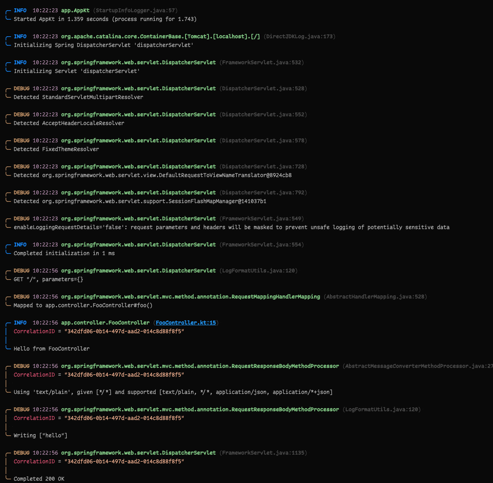

# Autoconfigure: Logback

Automatically configure Logback.

**Automatically use a structured JSON format in build environments.**

Or.. a prettier format for when you're developing.

## Supported platforms

- [Basic](https://github.com/TelenorNorway/autoconf-logback/tree/main/configuration/basic/README.md)
- [Spring Boot 3](https://github.com/TelenorNorway/autoconf-logback/blob/main/configuration/boot3/README.md)

## Formats

- [JSON](https://github.com/TelenorNorway/autoconf-logback/tree/main/formats/json)
- [Pretty](https://github.com/TelenorNorway/autoconf-logback/tree/main/formats/pretty)
